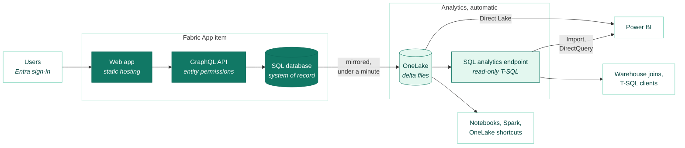

# Fabric CRUD App Template

A CRUD application template for [Microsoft Fabric Apps](https://learn.microsoft.com/fabric/apps/)
(preview). Define tables as TypeScript classes; one command deploys a SQL database, a GraphQL
API and a hosted, Entra-authenticated web UI into a Fabric workspace. Fabric's SQL analytics
endpoint then reads the same tables, so rows maintained in the app are immediately available to
Power BI, notebooks and warehouse loads.

Start here for any app where people maintain rows in a relational database: reference data,
master data, registers, mappings. Fork it, replace the sample tables with your own, and the UI
follows.

> **Don't put production workloads on this template until Fabric Apps is generally available.**
> Fabric Apps and the Rayfin SDK are in preview: APIs, CLI behaviour, limits and pricing all
> change between releases. This repo exists for exploring and evaluating the platform.


*The deployed app, opened from its workspace in the Fabric portal*

## Features

- **Full CRUD.** Edit and delete a row at a time, behind confirmation dialogs;
  referential-integrity errors come back in plain language.
- **Metadata-driven UI.** Adding a table to the UI is one line in the registry: the entity
  decorators drive tabs, columns, forms, labels, validation, search and column widths.
  No component names an entity or a field.
- **Bulk CSV import.** Start from a downloadable template; rows matching an existing business
  key become updates, identical rows are skipped, and a file that fails validation writes
  nothing. If a write fails mid-import, completed writes roll back.
- **Audit columns.** Every write stamps `createdAt/By` and `updatedAt/By`; the grid shows
  them as a history tooltip.
- **Queryable downstream.** Enter a row in the app and it reaches the SQL analytics endpoint
  about 30 seconds later.
- **Local development.** No Fabric tenant or credentials — a real SQL Server in Docker.

## How it works

Entity classes in `instances/<instance>/src/` carry the Rayfin SDK's decorators:

```typescript
import { authenticated, entity, set, text, uuid } from '@microsoft/rayfin-core';
import { Audited, AUDIT_IMMUTABLE } from './Audited.js';

@entity()
@authenticated(['read', 'create', 'delete'])
@authenticated('update', { exclude: [...AUDIT_IMMUTABLE] })
export class Region extends Audited() {
  @uuid() id!: string;
  @text({ min: 2, max: 2, unique: true }) code!: string;
  @text({ max: 200 }) name!: string;
  @set('Active', 'Retired') status!: 'Active' | 'Retired';
}
```

Deploying creates a Fabric **App** item with three child items: a
[SQL database](https://learn.microsoft.com/fabric/database/sql/overview) whose schema comes
from these classes, an authentication service brokering Entra sign-in, and static hosting for
the frontend, which builds its UI from the same decorator metadata at runtime and talks to the
database through the SDK's generated GraphQL API.

## Architecture



Everything to the right of the database is automatic: every table mirrors into OneLake as delta
files with no configuration, and the analytics endpoint serves those tables as read-only T-SQL.
Both paths read the same data — no copies. Who may use each hop is in
[docs/auth-and-permissions.md](docs/auth-and-permissions.md).

Two instances ship, each with its own tables
([instances](#instances-one-codebase-several-apps)). The four in `reference` — Currency,
Country, UnitOfMeasure, CostCentre — exercise the platform's type system: enums, decimals,
emails, dates, a foreign key, unique constraints, optional fields and defaults. `finance` is a
smaller, separate set. They are examples, not a product: delete them and add your own.

## Quick start (local, no Fabric account)

You need Node 20–24, and Docker for the local backend.

```sh
npm install
npm run dev:local     # starts SQL Server, Postgres and the API in Docker, then Vite
npm run seed          # once: sample rows — a new database is empty
```

Open the URL Vite prints; the app signs in with a local fixture account. A cold start takes
about 30 seconds, and the first run also pulls the Docker images. With the containers already
running, the script goes straight to Vite and applies any pending schema change.

```sh
npm run local:stop    # stop containers, keep data
npm run local:purge   # stop containers and delete data
```

Run the browser suite against the local stack — seed first; several tests need rows:

```sh
npm run e2e:install   # once: downloads a Chromium build
npm run e2e           # read-only tests; E2E_WRITES=1 adds self-cleaning write tests
```

## Instances: one codebase, several apps

An **instance** is a Fabric app — its own tables, its own Fabric item, its own users — built
from this one codebase, so a front-end improvement ships to every instance at once. The **item** is the
unit of separation, not the workspace: instances share the Test and Prod workspaces by default,
so a ten-instance estate is still two workspaces.

Everything instance-specific lives under `instances/<instance>/`; nothing else knows an
instance exists. `RAYFIN_INSTANCE` picks one; unset means `reference`, so the default needs no
ceremony:

```sh
RAYFIN_INSTANCE=finance npm run dev:local   # or set it once in rayfin/.env
```

Adding an instance is four files and one line. Adding a table is one file and two lines in a
registry. Both, and when instances should share a table, are in
**[docs/instances-and-tables.md](docs/instances-and-tables.md)**.

## Deploying to Fabric

```sh
npm run login   # interactive Entra sign-in, once
npm run up      # deploys the active instance's backend, schema and UI
npm run up:status
```

`RAYFIN_INSTANCE` picks which instance goes out, exactly as it does locally. In practice the
pipeline does the deploying: schema apply is owner-gated, so CI can never migrate an item
created by hand.

**[docs/operations.md](docs/operations.md)** has the rest: what a Fabric account needs first,
the one-off steps after a first deploy, the day-to-day commands and the CI/CD pipeline.

## Project structure

```
instances/            everything instance-specific; delete a directory, delete the instance
  <instance>/src/     that instance's tables, and index.ts registering them
  <instance>/seed.mjs its sample rows
packages/shared/      the audit contract every instance and src/db.ts need
instance.config.ts    RAYFIN_INSTANCE → the `@instance` alias, for Vite and Vitest alike
rayfin/rayfin.yml     service configuration. Comments do not survive `rayfin up`
src/                  the app — the same code for every instance, naming no entity
e2e/                  Playwright tests
scripts/              the local Docker backend, and the seeder
.github/workflows/    the PR gate and the deployment pipeline
docs/                 how to change the schema, how it deploys, what the platform does
```

Inside `src/` the flow runs one way: `entity.ts` turns decorator metadata into a view, `db.ts`
is the only data access, and the components render from that view alone. Every file opens with
a comment saying what it owns and why. Start with `entity.ts` for the idea, `EntityPage.tsx`
for the screen.

[Fluent UI React v9](https://react.fluentui.dev/) draws the UI — the design system the Fabric
portal itself uses, so the app looks native when embedded there. Server state lives in
[TanStack Query](https://tanstack.com/query); everything else is hand-written and small enough
to read directly. No router, no form library.

## Authentication and permissions

Entra handles all authentication; the session arrives differently per environment — free from
the portal, a local fixture under `dev:local`, brokered once for `npm run dev`. The app has
exactly two roles, `anonymous` and `authenticated`: no admin tier, no read-only role. Finer
control comes from Fabric **item** permissions, and each instance is its own item, so granting
someone one app grants them nothing in another. A workspace is the
coarser boundary; a workspace role carries implied permissions on *every* item in it.

Two properties matter before storing anything sensitive. Static assets are served from a public
URL, so nothing secret belongs in frontend code; the SQL database is read-only in the Fabric
portal, so `instances/<instance>/src/` is the only path for schema changes.

The full model — sign-in flows, workspace roles, item permissions, entity rules and downstream
query access, organised by persona — is in
**[docs/auth-and-permissions.md](docs/auth-and-permissions.md)**.

## Known limitations

Several sharp edges of the preview shape this codebase. The measured ones are written up with
evidence in **[docs/platform-constraints.md](docs/platform-constraints.md)**; the ones that
bite while writing code are tabulated in [CLAUDE.md](CLAUDE.md).

Microsoft scopes Fabric Apps to internal tools, prototypes and data applications — not to
workloads needing multi-step transactions or custom authentication.

## Documentation

| | |
| --- | --- |
| [instances-and-tables.md](docs/instances-and-tables.md) | Adding an app, adding a table, sharing one, bulk import |
| [operations.md](docs/operations.md) | Environments, the deployment pipeline, recovery, observability |
| [auth-and-permissions.md](docs/auth-and-permissions.md) | The full identity and access model |
| [platform-constraints.md](docs/platform-constraints.md) | Measured platform behaviour no documentation states |

## Licence

[MIT](LICENSE).
