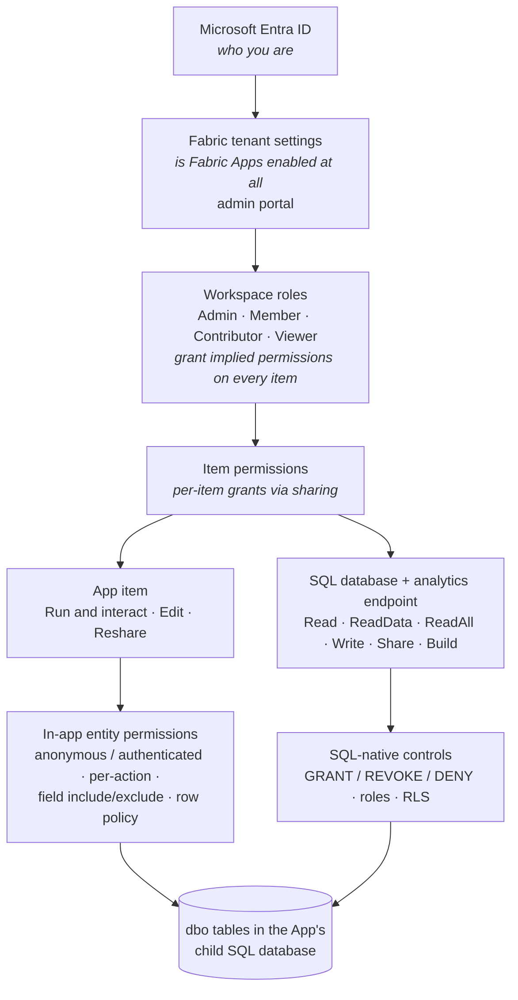
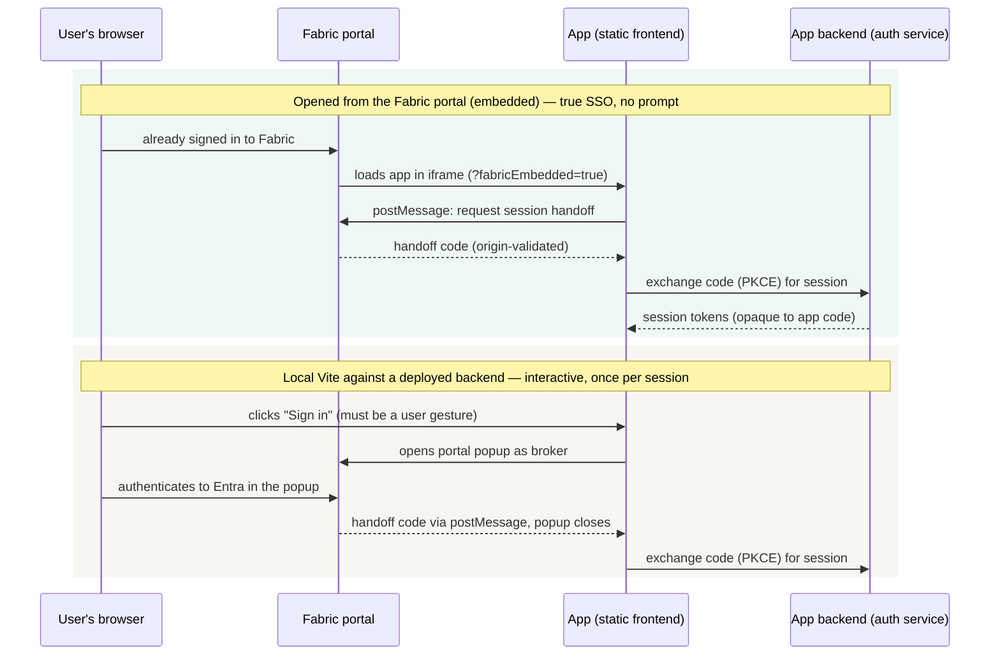

# Authentication and permissions

Read this before granting anyone access, and before trusting the app with data that matters.
It covers identity and access for an app built on Fabric Apps — from Entra sign-in down to
who can read the mirrored data from a notebook.

Two kinds of claim appear here. Statements about the platform's design cite the official
documentation, linked throughout. Statements marked **measured** were observed against this
deployed app (CLI 1.34.0, Fabric Australia East, 2026-08-15) and record behaviour the
documentation does not state — or states differently. The platform is in preview; re-verify
measured claims after SDK upgrades.

## The model in one picture

Five layers decide what a person can do, each configured in a different place by a different
role. The tenant switch gates everything below it; workspace roles and item sharing are
additive routes into an item; the in-app and SQL layers then bind whatever got through:



The fork at the bottom is the single most important fact in this document:

**The app and the database are two separate permission planes over the same tables** —
and "tables" here means something specific: the `dbo` tables inside the App item's child
**SQL database**, the operational store the entity classes generate. (Fabric has many things
called tables; these are not lakehouse or warehouse tables.) A third surface sits downstream:
those same rows are mirrored into OneLake as **delta tables**, which the SQL analytics
endpoint serves read-only under its own grants — same data, a third door.

- Using the **app** requires *Run and interact* on the App item, and nothing else. Inside it,
  the entity permission decorators decide everything a signed-in user can do; the user's SQL
  or workspace permissions play no part, because the app's managed data layer makes the
  database calls itself.
- Querying the **database directly** (SQL editor, analytics endpoint, notebook, Power BI) runs
  under the user's own Entra identity, governed by Fabric item permissions and SQL-native
  controls; the app's entity rules play no part there.

The enterprise consequence: an app-level field `exclude` hides a column from app users, but
anyone granted *ReadData* on the database reads every column of every table. Conversely, app
users need no database permissions at all. Reason about grants on the two planes separately.

## What each persona needs

Which plane a person needs settles the grant:

| Persona | Grant | What they get / must know |
|---|---|---|
| **App user** (maintains data) | *Run and interact* on the App item — default for workspace members, shareable to anyone in the org | Full CRUD the entities allow. Opens from the portal, no sign-in prompt, provisioned on first use. No database access implied |
| **Read-only consumer** | Workspace **Viewer**, or share the database/endpoint with *ReadData* | Read every table, every column, read-only. The app has no in-app read-only mode — read-only means reading via SQL or Power BI, not via the app |
| **Analyst / data engineer** | *ReadData* on the **analytics endpoint** (not the primary) | Mirrored data under a minute behind (measured 27–63 s), joins across items, zero load on the app. Reconnect to see fresh data |
| **Report author** | *Build* on the semantic model, or endpoint ReadData | Reports over live reference data with no export or copy |
| **Developer / deployer** | *Edit* on the App item (minimum); Contributor role in practice | `rayfin login` (interactive Entra), `rayfin up` for settings and static. Schema is the owning identity's alone (ownership rule, Layer 3) — the dev loop is local Docker. Can read and modify all data. No platform rollback — redeploy an earlier commit |
| **CI principal** | **Measured 2026-08-15**: a user-assigned managed identity, federated to GitHub OIDC (no client secret), Contributor on exactly its own workspace, token via `az account get-access-token` → `RAYFIN_TOKEN` | Deploys, creates and owns the items, applies schema as owner. Two identities — Test and Prod — with token issuance pinned to branch and environment. Deployment flow: [operations.md](operations.md) |
| **Tenant admin** | Admin portal | Enables *Fabric Apps (preview)*; decides *Anonymous data access* (leave off unless a public-data scenario demands it); both scopable to security groups |
| **Security reviewer** | This document | Plus: static assets are on a **public URL** — auth guards the data plane, not the bundle, so no secrets in frontend code. The `publishableKey` is a routing identifier, client-safe by design. Transport is TLS 1.2; storage is encrypted at rest; tenant-level private links exist ([security overview](https://learn.microsoft.com/fabric/database/sql/security-overview)). Unauthenticated probes leak nothing (measured: fast 401s, no data in error bodies) |

## Recommended shapes

These combine into four shapes:

- **Small team, everyone trusted:** workspace Members. Everyone uses, everyone deploys.
  Simplest, and what a personal workspace amounts to anyway.
- **Enterprise default — users use, CI deploys:** keep the workspace to the platform team,
  and share the App item (*Run and interact*) with the user audience via a security group.
  The deploying principal alone gets *Edit*; analysts get endpoint *ReadData*. Nobody else
  touches the database items.
- **Finer-grain than all-or-nothing data access:** share the database with Read only, then SQL
  `GRANT SELECT` on specific views (build them on the endpoint) — or RLS keyed to
  `USER_NAME()`. This is the escape hatch for "steward sees only their region" that the app
  layer cannot express.
- **Public reference data:** tenant admin enables anonymous access, entity grants
  `@anonymous('read')` and nothing else, and the security guidance in
  [the anonymous-access doc](https://learn.microsoft.com/fabric/apps/anonymous-data-access)
  applies. Not enabled in this repo.

## Layer 1: Sign-in

All production identity is Microsoft Entra ID, and there is no separate account store to
manage — a user is provisioned automatically on first sign-in
([authentication concepts](https://learn.microsoft.com/fabric/apps/authentication)). The three
environments differ only in how the session arrives:



| Environment | Session arrives by | Prompts | Notes |
|---|---|---|---|
| Deployed, opened from the portal | `postMessage` handoff from the host (embedded mode) | Never | True SSO ([SSO flow](https://learn.microsoft.com/fabric/apps/fabric-authentication)) |
| `npm run dev` against a deployed backend | Portal popup as an interactive broker | Once per session | A stored refresh token is spent first, so reloads do not re-prompt. **Measured:** the portal URL carries no tenant hint, so a browser signed into a personal Microsoft account gets the portal's own 401 — `portalUrlForTenant()` in [src/rayfin.ts](../src/rayfin.ts) pins `ctid` |
| `npm run dev:local` (Docker) | Email/password fixture account | Never | Local development only; password auth does not function after deployment |

PKCE (S256), a state nonce, `postMessage` origin validation and a five-minute expiry protect
the flow — see
[Configure Fabric SSO](https://learn.microsoft.com/fabric/apps/fabric-authentication).
Sessions are opaque: application code reads `isAuthenticated`, `id`, `email` and any custom
claims, never raw tokens. The SDK persists, refreshes and multi-tab-syncs sessions itself.

**Measured:** a decoded access token carries exactly
`sub, email, name, role, jti, iat, exp, nbf, iss, aud, sid`. `role` is `"Authenticated"` for
every signed-in user (see [Layer 5](#layer-5-app-plane-in-app-entity-permissions)).

**Measured (2026-08-15):** both deployed sign-in modes work end to end against a
**pipeline-created** Prod item whose redirect allow-list CI injects per environment. The
standalone session survived a full browser restart on its refresh token. Rows created in these
sessions carried the signed-in **real Entra UPN** in the audit columns, immediately and in the
deployed UI, and the bulk CSV importer worked against deployed Prod exactly as it does locally.

## Layer 2: Tenant settings

Two admin-portal switches, both under **Tenant settings → Fabric apps (preview)**:

- **Fabric Apps (preview)** — must be enabled before anything deploys. Without it (or in an
  [unsupported region](https://learn.microsoft.com/fabric/admin/region-availability)), the
  failure reads like a permissions problem.
- **Anonymous data access** — off by default, and until it is on (org-wide or per security
  group) no `anonymous` entity role works: the entity role alone grants nothing
  ([anonymous data access](https://learn.microsoft.com/fabric/apps/anonymous-data-access)).
  This app's sample entities grant the `anonymous` role nothing.

## Layer 3: Workspace roles

Workspace roles are assignable to users, security groups and **service principals**
([reference](https://learn.microsoft.com/fabric/fundamentals/roles-workspaces)). What each
role means for this app, from the
[SQL database authorization table](https://learn.microsoft.com/fabric/database/sql/authorization):

| Capability | Admin | Member | Contributor | Viewer |
|---|---|---|---|---|
| Use the deployed app (*Run and interact* is granted to all workspace members by default) | ✅ | ✅ | ✅ | ✅ |
| Deploy the app — settings and static content (needs *Edit* on the App item) | ✅ | ✅ | ✅ | — |
| Apply **schema** (owner only — see below) | owner only | owner only | owner only | — |
| Full data access on the SQL database (*Write*) | ✅ | ✅ | ✅ | — |
| Read all data — SQL database, analytics endpoint, OneLake (*Read/ReadData/ReadAll*) | ✅ | ✅ | ✅ | ✅ |
| Share items / manage others' access | ✅ | ✅ | — | — |

- **Workspace Viewer is the read-only tier this platform actually has.** A Viewer can query
  every table read-only through the SQL editor or the analytics endpoint and still *use* the
  app, where the entity rules decide what they write. The entity model is the only lever that
  stops them writing through the app, and it applies to everyone equally (Layer 5).
- **Contributor is a deployment role here — with one measured carve-out.** Contributor and
  above effectively hold *Edit* and *Write* everywhere in the workspace: update the app's
  settings and static content, read or modify all data. But **schema applies are gated on item
  *ownership***, not role: only the identity that *created* the App item can apply schema;
  everyone else gets a 403, and `rayfin up` swallows that failure while exiting 0 (measured
  2026-08-15, [platform-constraints](platform-constraints.md)). On pipeline-created items the
  pipeline identity alone holds schema; on human-created items, that human alone. Keep
  workspace membership small and use item sharing for everyone else.

## Layer 4: Item permissions

Sharing an item is the other route in;
[workspace roles do not supersede them](https://learn.microsoft.com/fabric/apps/overview#management-in-the-fabric-portal)
— the two are additive paths to the same grants. Sharing reaches people with **no workspace
role at all**, the normal enterprise shape: a small workspace team, a broad audience reached
by item grants.

**The App item** ([overview](https://learn.microsoft.com/fabric/apps/overview),
[deploy](https://learn.microsoft.com/fabric/apps/deploy-app)):

| Permission | Grants |
|---|---|
| **Run and interact** (default for workspace members) | Open the app and invoke its backend APIs |
| **Edit** (Write) | Deploy with `rayfin up` — settings, static content, child services |
| **Reshare** | Grant others access onward |

**"People use it, only CI deploys it" is directly expressible:** share the app with *Run
and interact*; give the deploying principal *Edit*. The prerequisite: the deploying
principal must be the identity that **creates** the item, or its schema applies 403
(ownership rule, Layer 3). A pipeline adopting a human-created item must recreate it
([operations.md](operations.md)).

**Measured with a second, unprivileged identity** (2026-08-15, a purpose-made Entra user
holding nothing to start). The boundary tiers behave exactly as the model claims:

| Given | App/deploy | SQL data |
|---|---|---|
| **Nothing** (signed in, no grant) | App backend 401; no workspace visible; cannot deploy | SQL connect refused ("Validation of user failed"). *Static bundle serves 200 — public by design* |
| **Run and interact** on the App item | Permission row reads exactly *Read, Execute*; can invoke the app; **deploy refused** (write proxy 401) | none implied |
| **Read** on the DB item **+** a SQL role granting `SELECT` on one table | — | Connect + `SELECT` that table only; every other table's `SELECT` **denied**; `INSERT` **denied** |
| **Workspace Viewer** | deploy refused (write proxy 401) | reads **every** table; `INSERT` **denied** |

- **Run and interact ≠ management-API read.** A *Read, Execute* holder can use the app but
  cannot `GET` its item through the Fabric REST API — that needs *Write*. Using the app and
  enumerating the item via API are different grants; do not test one with the other.
- **Item-permission propagation is slow.** A fresh item share had not taken effect after
  several minutes; budget the documented two hours before a newly granted user can act.
  Workspace-*role* assignment propagated much faster.

**The SQL database and its analytics endpoint**
([authorization](https://learn.microsoft.com/fabric/database/sql/authorization),
[sharing](https://learn.microsoft.com/fabric/database/sql/share-sql-manage-permission)):

| Permission | Grants |
|---|---|
| **Read** | Connect only — metadata, no table reads. The floor for any SQL access |
| **ReadData** | Read **all** data and metadata via T-SQL — grantable separately for the database and for the analytics endpoint |
| **ReadAll** | Read the mirrored delta files via OneLake APIs / Spark |
| **Write** | Full administrative and data access |
| **Share** | Manage the item's permissions |
| **Build** | Build Power BI reports on the database's semantic model |

Details that decide how a share behaves:

- The share dialog's options map onto these: *"Read all data using SQL database"* → ReadData
  on the database; *"Read all data using SQL analytics endpoint"* → ReadData on the endpoint
  only — a clean way to give analysts the mirrored copy without touching the primary.
- Sharing with **no** additional permissions (Read only) is the deliberate starting point for
  granular control: pair it with SQL `GRANT` on specific objects.
- Item grants create **no SQL principals** and appear in no SQL catalog view; Fabric-level and
  SQL-level security metadata are disjoint. Audit both when reviewing access.
- Connecting to the analytics endpoint requires control-plane Read on the item regardless of
  any SQL permissions
  ([OneLake security for endpoints](https://learn.microsoft.com/fabric/onelake/security/sql-analytics-endpoint-onelake-security)).

## Layer 5, app plane: in-app entity permissions

Inside the app, the entity classes declare authorization and the managed data layer enforces
it on every API request
([data permissions](https://learn.microsoft.com/fabric/apps/data-permissions)). The building
blocks:

- **Roles:** `anonymous` and `authenticated`, per action (`create`, `read`, `update`,
  `delete`, `*`).
- **Field rules:** `include`/`exclude` arrays per action, typed to the entity's properties —
  renaming a field is a compile error in every list that names it.
- **Row policies:** typed expressions over `claims` and the row, compiled into the data
  layer: `policy: (claims, item) => claims.sub.eq(item.ownerId)`, composable with
  `.and()`/`.or()`.

This app grants `authenticated` full CRUD on every sample table, in both instances, with
`createdAt` and `createdBy` excluded from `update`. (The other two audit columns stay
writable — every edit re-stamps them.) A row's *origin* is therefore server-enforced:
**measured**, a hand-crafted mutation touching `createdBy` on update fails whole and leaves
the row untouched.

What the decorators **cannot** express, and the honest limits (all **measured** except where
linked):

| The limit | The detail |
|---|---|
| **Exactly two effective roles.** | The docs show `claims.role.eq('admin')` as a pattern. It compiles and can never match: every signed-in user's `role` claim is `"Authenticated"` — the control-plane role column collapses all values ≥ 1 to it, there is no third value and no API to set one. No admin tier, no read-only user, no maker-checker *inside* the app. |
| **Custom claims are per-project, not per-user.** | `customClaims` in `rayfin.yml` attach the same static values to every session ([docs](https://learn.microsoft.com/fabric/apps/authentication)) — usable for feature flags, not for distinguishing people. (Locally they also never appeared in the token; not retested on Fabric.) |
| **Row policies see `sub` and `email` equality.** | One named person, or everyone signed in — those are the expressible in-app authorization models. |
| **An entity with no permission decorator fails open.** | Full CRUD for any signed-in user, silently. Nothing in the docs warns about this. This repo's `src/instances.test.ts` fails the build on an undecorated entity, in every instance — keep that test when forking. |
| **The create path cannot protect attribution.** | `exclude` guards `update`; on `create` the app must write all four audit columns, so who *created* a row is assertable by whoever creates it. Audit columns are attribution, not enforcement — there is no server-side clock or identity to stamp them. |

## Layer 5, data plane: SQL-native controls

SQL-native controls sit under all of this, on both the database and the endpoint:
`GRANT`/`REVOKE`/`DENY`, database roles, row-level security, column-level security, dynamic
data masking ([granular permissions](https://learn.microsoft.com/fabric/data-warehouse/sql-granular-permissions),
[configure access controls](https://learn.microsoft.com/fabric/database/sql/configure-sql-access-controls)).
`DENY` always wins. Neither obvious case needs them: **never for the app plane** — the managed
data layer enforces the entity decorators and connects as its own identity — and **never for
all-or-nothing downstream access**, which *ReadData* on the item covers. SQL grants exist for
the middle ground: *this* person may read *these* tables, views or rows.

Measured against the deployed database (2026-08-15):

- On a SQL **database**, create the principal explicitly first —
  `CREATE USER [user@tenant.com] FROM EXTERNAL PROVIDER` works with any Entra identity. The
  create-on-`GRANT` shortcut in the docs applies to the **warehouse/endpoint** surface, not
  the database.
- Grants to **roles** behave exactly as expected and are the pattern to use:

  ```sql
  CREATE USER [analyst@contoso.com] FROM EXTERNAL PROVIDER;
  CREATE ROLE reference_readers;
  GRANT SELECT ON dbo.Currencies TO reference_readers;
  ALTER ROLE reference_readers ADD MEMBER [analyst@contoso.com];
  ```

  A grant alone lets nobody in: the recipient still needs Fabric-level **Read** on the item to
  connect (share with "no additional permissions"); the SQL grant then scopes what they can
  query. Enforcement is verified with a second identity (boundary table, Layer 4).
- **SQL principals and grants survive deploys.** The user object, role and object grant all
  persisted through both a full `rayfin up` and `db apply` cycles — the deployment pipeline
  does not reset in-database security. (A restored backup, however, carries security only
  as of its restore point.)
- One oddity: granting object permissions **to your own admin principal** reported success
  but never materialised in `sys.database_permissions`. Grant to roles, not to yourself, and
  verify against the catalog rather than trusting the `GRANT` statement's return.

## Downstream: the analytics estate

Every `dbo` table in the SQL database is mirrored automatically into OneLake as a
**delta table** and readable through the SQL analytics endpoint
([mirroring](https://learn.microsoft.com/fabric/database/sql/mirroring-overview),
[endpoint](https://learn.microsoft.com/fabric/database/sql/sql-analytics-endpoint)) — that is
the point of putting reference data here. Access facts for whoever consumes it:

- The endpoint is **read-only by design** (measured: writes refused with error 24559), so
  granting it is safe against accidental mutation.
- The consumer needs *ReadData* on the endpoint (or workspace Viewer or above); for finer
  grain, layer row-level and column-level security on the endpoint itself.
- Audit attribution flows downstream (**measured:** `updatedBy` written through the app was
  queryable in the endpoint 27 s later, carrying the signed-in Entra UPN) — useful for
  lineage, but it also means **the audit columns are visible to every ReadData holder**.
  Treat attribution emails as data you are granting.
- **Measured:** an open endpoint session pins a snapshot and never sees new data — poll by
  reconnecting, or conclude (wrongly) that mirroring is broken.
- Report authors need Power BI **Build** on the default semantic model: a separate, narrower
  grant than ReadData.

## Known discrepancies and open questions

- The Learn deployment page says authenticated users can be managed "in the **Users** table
  in the child SQL Database". **Measured:** `dbo.Users` exists but stayed empty locally *and*
  on Fabric after real sign-ins; the populated identity store was the control-plane database.
  Do not build user management on that table without re-verifying.
- Guest (B2B) users remain documented-but-unexercised from this repo. Service-principal
  deploys are measured end to end (federated managed identity, 2026-08-15) — see the CI
  principal persona and [operations.md](operations.md). Item-permission boundaries and SQL
  grant survival are measured with a second identity — see Layer 4 and the data-plane section.
- Everything measured was measured on a preview platform on the dates given. The two-role
  collapse in particular looks like preview state rather than architecture — the docs'
  `admin` examples suggest richer roles are intended eventually. Re-test after upgrades.

Measured claims were observed against this deployed app and are stamped inline; platform-wide
findings and their evidence live in [platform-constraints.md](platform-constraints.md).
