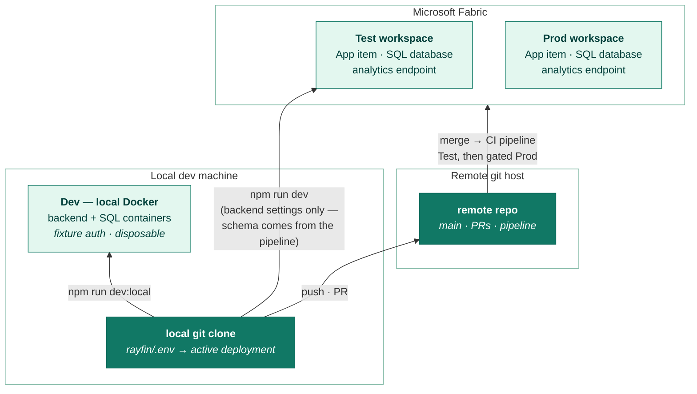
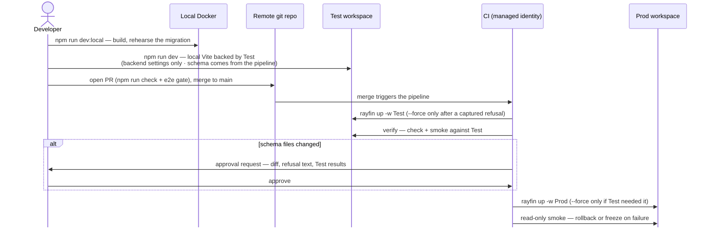
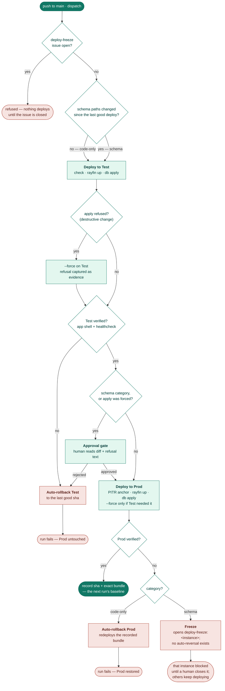

# Operating the app: environments, the pipeline, recovery, observability

Everything after the code is written: where it runs, how it gets there, what to do when a
deploy goes wrong, and what you can see once it is live.
[instances-and-tables.md](instances-and-tables.md) covers making changes; this file covers
shipping and running them.

**Measured** claims were verified against the deployed app (CLI 1.34.0, 2026-08-15);
**documented** ones come from the SDK or Microsoft Learn and have not been exercised here.

## Environments

The design: **one Fabric workspace per environment, one codebase, promotion by redeploying a
git ref**. There is no separate staging infrastructure to build — a workspace *is* an
environment boundary in Fabric (permissions, capacity, and items all scope to it), and the CLI
is already multi-workspace aware.

Every [instance](instances-and-tables.md) deploys into the same two workspaces by default —
a ten-instance estate is still two workspaces — and each is a separate Fabric item. To send
one elsewhere, set `FABRIC_{TEST,PROD}_WORKSPACE_ID_<INSTANCE>`; that override is a plain
per-instance lookup with no distinctness check, so pointing several instances at the same id
groups them into a shared workspace of their own. Isolation and grouping are the same
variable.

Sharing a workspace is safe to deploy into but changes who can read what: workspace roles
grant implied permissions on **every** item, and a Viewer can read every table over SQL — so
give domain users the **app item**, never a workspace role. A second hazard is local only: the
CLI resolves its target from a **workspace-keyed** registry, so deploying a second instance
from a checkout that already has a record retargets the first instance's item
(measured — [platform-constraints.md](platform-constraints.md#several-apps-from-one-codebase)).
CI never hits it: every job is a fresh checkout.



### The mechanics (measured against the installed CLI)

The CLI keeps a per-workspace deployment registry, so one clone can hold every environment:

- `rayfin up -w <workspace-name>` targets a workspace — as does `--workspace-id`, or
  `--workspace-uri` pasted from the portal. Omit it and the CLI reuses the recorded active
  deployment; with nothing recorded (a fresh clone) it prompts for a workspace, and **refuses
  in a non-interactive shell**. The first deploy into a workspace creates the item there;
  later deploys update it.
- `rayfin/.deployments.json` records every deployment — item id, workspace id, API URL,
  hosting URL, publishable key, timestamp and more — keyed by workspace, with one marked
  `active`. The file is gitignored: it describes *your* deployments, not the project.
  **The key is the workspace, not the item**, so deploying a second instance into a workspace
  that already has a recorded deployment targets the recorded *item* rather than creating a
  new one. CI is unaffected — a fresh checkout has no registry. Locally, remove the record or
  work on one instance at a time.
- `rayfin up list` prints the registry; `rayfin up switch <workspace>` changes the active
  deployment **by rewriting `rayfin/.env`** and regenerating `.env.local`
  (`--no-emit-env` skips the second part).
- `rayfin.yml` needs no per-environment copies. Its `id:` is the project's logical identity
  and stays identical everywhere — the physical item ids live in the registry.
  `${VAR:-default}` interpolation from `rayfin/.env` keeps deployment-specific values out of
  git.

### The rules that make it safe

1. **Local Docker is the dev environment.** Free, credential-free, disposable; schema changes
   rehearse there first. Fabric workspaces start at Test.
2. **Treat `rayfin/.env` as a pointer, not a config.** It names the active deployment.
   Three commands rewrite it (`up`, `env`, `switch`); Vite reads it once, at startup.
   Every mixed-up-backend incident this repo has recorded came down to this pointer moving
   unnoticed. `npm run dev:local` repairs it when the local backend is healthy; after any
   `up` or `switch`, assume it moved.
3. **Rehearse schema changes before they reach real data.** Migrations have no
   down-migration and no dry-run, and some rewrite stored rows silently
   ([the three-bucket contract](platform-constraints.md#changing-a-live-schema)).
   Rehearse locally with `npm run local:db`, then let the
   [pipeline](#the-deployment-pipeline) carry the change through Test to Prod. And read
   every refusal: a `--force` that was harmless against Test's empty table can still
   destroy Prod's data.
4. **Permissions differ per environment by construction.** On Prod, users hold **Run and
   interact** and only the deploying principal holds **Edit**; on Test, the team does
   ([auth-and-permissions.md](auth-and-permissions.md)). That is what makes
   `npm run dev`'s deploy-first behaviour safe: a developer pointed at Prod by mistake
   fails with a permission error, not a schema change.
5. **CI deploys as a federated managed identity — no client secret exists anywhere.**
   Every job that talks to Fabric exchanges its GitHub OIDC token for a Fabric token when
   it starts. Two identities exist, each Contributor on exactly one workspace: the Test
   identity's token can only be minted by `main`-branch jobs, the Prod identity's only
   inside the `production` environment — which is to say, after the gate. "Only the
   pipeline deploys Prod" is enforced by token issuance, not convention. Setup mechanics
   and the one subject-format trap live in the
   [fork guide](#standing-the-pipeline-up-from-a-fork).
6. **Contain cost blast radius.** Environments can sit on different capacities, and a SQL
   database can be capped with a
   [maximum vCore limit](https://learn.microsoft.com/fabric/database/sql/control-compute-usage) —
   worth setting on Test so a runaway query rehearsal never throttles Prod's capacity.

## Deploying without the pipeline

The pipeline owns deployed schema (see the ownership doctrine below). These commands bootstrap
a fork or a throwaway item; they are not how you change an item CI manages.

### What a Fabric account needs

Fabric Apps is a preview feature with three requirements that fail unhelpfully when missed:

1. **Region.** Your capacity must be in a supported region — the list grows with the
   preview, so check the
   [availability list](https://learn.microsoft.com/fabric/admin/region-availability) rather
   than any snapshot of it. (This repo runs on Australia East; an unsupported region fails
   looking like a permissions problem, not a region problem.)
2. **Tenant setting.** A Fabric admin must enable **Fabric Apps (preview)** in the admin
   portal.
3. **Capacity.** The workspace needs Fabric capacity assigned. A personal "My workspace" assigned to a Fabric
   capacity suffices.

Running the app consumes capacity units — at the time of writing, SQL compute and storage,
GraphQL request processing, and OneLake reads for serving the UI. Preview pricing is the kind
of fact that changes: check [pricing](https://learn.microsoft.com/fabric/apps/pricing) before
relying on any meter or free tier named here.

### Deploying by hand

```sh
npm run login         # interactive Entra sign-in, once
npm run up            # deploys backend, schema and UI; first run takes 2–5 minutes
npm run up:status     # prints the hosting URL and health
```

A keychain error from `npm run login` means npm skipped a dependency's install scripts: it no
longer runs them unless `allowScripts` covers the package, and it lists the blocked ones on
every install (six here, `keytar` among them). Approve the one that matters —
`npm install-scripts approve keytar` — or rebuild after the fact with
`npm rebuild keytar @azure/msal-node-extensions esbuild`.

The first `up` in a fresh clone has no recorded deployment to reuse, so it asks which
workspace to target. In a non-interactive shell it refuses instead; pass
`-- --workspace <workspace-name>`. Every later `up` and `npm run dev` reuses the recorded
choice.

After the first deploy:

1. Copy `rayfin/.env.example` to `rayfin/.env` and set `RAYFIN_HOSTING_URL` to the printed
   URL.
2. Delete the literal URL the deploy appended to `rayfin.yml`; the `${RAYFIN_HOSTING_URL:-…}`
   placeholder survives.

The first deploy necessarily runs before `.env` exists, so the CLI writes your URL into the
committed config once.

Day-to-day commands:

```sh
npm run rayfin:db     # apply schema changes only
npm run up:static     # redeploy the frontend only (30–60 seconds)
npm run dev           # DEPLOYS backend + schema to the active deployment, then Vite against it
```

Open the deployed app from the Fabric portal — the session comes with you.

`id:` in [rayfin.yml](../rayfin/rayfin.yml) is `fabric-app-${RAYFIN_INSTANCE:-reference}` —
both the Fabric item's identifier and the display name people see in the workspace. Changing
it creates a **new** item on the next deploy rather than renaming the existing one: the
mechanism instances rely on, and also how a typo strands an item. There is no platform-side
rollback; to roll back, check out an earlier commit and deploy again.

Deploying a second instance from the same checkout needs the same care as above: the registry
is keyed by **workspace**, so a stale record retargets the wrong item
([platform-constraints.md](platform-constraints.md#several-apps-from-one-codebase)). CI is
unaffected — a fresh checkout has no registry.

## The deployment pipeline

*Built 2026-08-15, made per-instance 2026-08-16; every branch has executed in a real run
(`.github/workflows/deploy.yml`, `deploy-instance.yml`, `pr.yml`). `deploy.yml` only lists the
instances and fans out; `deploy-instance.yml` is the pipeline below and runs **once per
instance, in parallel and independently** — a reusable workflow rather than a matrix on each
job, because `needs` between matrix jobs waits for every leg and one instance's failed Test
deploy would otherwise block another's Prod deploy. Mechanisms rest on measured platform
behaviour ([platform-constraints.md](platform-constraints.md)); the rehearsal record is
below; superseded alternatives are in CLAUDE.md.*

The life of one change, end to end:



### How a deploy is decided

**The pipeline is the only routine path to Prod to maintain code as the source of truth.** A
commit, a run, and that run's recorded evidence should account for every state Prod has ever
been in. A manual deploy breaks that twice: the record stops describing reality, so the next
run compares against the wrong baseline, and the safety machinery only protects what flows
through it. One exception is mechanical — the platform demands a workspace Admin, so exactly
one break-glass identity exists, and the runbook below holds its rules. Ceremony scales with
risk; there are no release tags.

**The two GitHub environments do different jobs.** `production` has no reviewers; it exists
only to pin the Prod identity's credential to post-gate jobs. `schema-change-approval` holds
the human gate. Token issuance and human approval are separate mechanisms, so they get separate
environments.

**The ownership doctrine: the platform gates schema applies on item *ownership*, not workspace
role.** Only the identity that created an item can change its schema, so every pipeline-managed
item has to be created by the pipeline identity — and once it is, no human can apply schema
to it interactively. That makes the dev loop local Docker by construction rather than by
convention. Details: [platform-constraints](platform-constraints.md).

**One signal, two categories.** A deploy is a **schema change** when anything under the
instance's own `instances/<instance>/`, the shared `packages/shared`, or `rayfin/rayfin.yml`
differs from that instance's last-deployed commit; otherwise it is **code-only**. Git supplies
the signal because the CLI supplies none: a successful apply looks identical whether it did
nothing, added a column, or silently rewrote data. The classification stops there on
purpose — telling additive from destructive is the platform's job, surfaced as the
approval's evidence, not the pipeline's guesswork.

| Category | Path to Prod |
|---|---|
| Code-only | Fully automatic: Test, verification, Prod, smoke — no human. |
| Schema change | Automatic through Test verification, then **one approval** — evidence: the schema diff, any refusal text, Test results. |

Every decision a deploy makes, and every way it can end:



### The flow on merge to main

PRs run `npm run check` and e2e against a seeded runner-local Docker backend; the deploy
re-runs `check`, so a direct push to main is gated too. A concurrency group serialises deploys.

1. **Freeze check, then categorize** with the diff above. An open `deploy-freeze:<instance>`
   issue fails the run immediately. The first-ever run has no recorded sha and defaults to
   the schema category.
2. **Deploy Test.** `rayfin up`, then schema as a *separate* `db apply` step — the umbrella
   command reports success even when its schema apply fails. The pipeline captures a
   destructive refusal and retries with `--force`: rehearsing destructive changes is Test's
   job, and the refusal becomes the approval's evidence. Deployed Test data is **disposable
   by decision** — a rehearsal may wipe it and nothing restores it automatically. (The seeder
   signs into local backends only; the CSV importer is the recovery if anyone wants one.)
3. **Verify Test** — smoke: the static bundle serves the app shell and the backend's
   `/healthcheck` answers 200 (measured: the deployed API exposes it unauthenticated). On
   failure Test rolls back automatically (redeploy the last-deployed sha, forced as needed)
   and the run stops; Prod is untouched.
4. **Gate.** Schema changes pause here — and so does any run whose Test apply needed
   `--force`, because drift can hide a destructive apply inside a code-only diff. The
   evidence is in the "Deploy to Test and verify" job summary; an environment pause happens
   *before* the gate's job starts, so anything that job wrote would appear only after you
   approved. Decide promptly: a waiting run holds the deploy queue, so an unattended gate
   freezes the release train. The queue is otherwise latest-wins — pending runs collapse to
   the newest, the diff base spanning the skipped commits.
5. **Record the PITR anchor** — the UTC instant before the Prod apply, written into the run
   summary. Fabric's continuous 7-day point-in-time restore makes that instant recoverable
   ([Backup and restore](#backup-and-restore)).
6. **Deploy Prod** — unforced; `--force` only if Test required it. If Prod refuses where
   Test did not (the guard is structural; the data differs), halt and surface Prod's own
   refusal — the pipeline never escalates force unattended. One change class fails here
   regardless of approval: an in-use enum value cannot be removed even with `--force`.
7. **Smoke Prod** (read-only, same two assertions), upload the exact built bundle as a run
   artifact, then record the sha — with the run id in the deployment payload — as a
   successful `production` deployment via the GitHub Deployments API. The sha is the next
   run's diff base; the run id lets a rollback fetch this bundle.

### When it goes wrong

The jobs `rollback-test`, `rollback-prod` and `freeze` in deploy-instance.yml:

| Failure | Response |
|---|---|
| Test deploy or smoke fails — or the gate is **rejected** | Automatic rollback of Test to the last-deployed sha, stop. Prod untouched. Rejection rolls Test back so the retry's apply re-produces the refusal evidence instead of reading clean. |
| Prod fails, code-only category | Automatic redeploy of the last-good sha. The static content is the **recorded bundle from the last successful deploy** — the exact bytes that passed smoke, not a fresh rebuild that could differ (toolchain drift, nondeterminism). |
| Prod fails, schema category | **Freeze.** No automated reversal: there are no down-migrations, so a "rollback" is a *new* destructive migration — dropping a just-added column deletes its data, re-widening a narrowed scale restores nothing, and old code may not even run against a reverted schema. The pipeline opens a `deploy-freeze:<instance>` issue pointing at the run (restore point, applied diff, failure output), and that instance's categorize job refuses to deploy while it is open. The label is per instance on purpose: a failed migration's blast radius is one database, and freezing every domain because one broke would destroy the benefit a shared codebase exists to provide. Closing the issue is the deliberate human act of unfreezing. |

There is deliberately **no pre-deploy data export**: PITR plus the anchor is the whole
recovery story. Damage found after the 7-day window has no backup to return to; that risk is
accepted (see "Designs that already lost" in CLAUDE.md). Rollback bundles live as run
artifacts under the repository's artifact retention setting — GitHub's 90-day default here —
long enough unless successful Prod deploys ever sit more than 90 days apart, at which point a
rollback rebuilds the base sha from source (exercised deliberately — the rehearsal record
below). If both the bundle and the rebuild fail, the answer is the freeze's answer: **roll
forward** — fix at head and deploy through the pipeline rather than improvising backwards.

### Runbook: the freeze

In order of preference:

1. **Forward-fix.** Repair at head and deploy through the pipeline.
2. **A deliberate reverse migration.** A new schema change that undoes the damage,
   knowingly destructive.
3. **PITR restore.** Creates a *sibling* database to copy data back from, never a swap
   ([Backup and restore](#backup-and-restore)).

Before any manual repair surgery, export the affected tables via the SQL analytics endpoint.
Drill a restore quarterly: an unrehearsed backup is a hypothesis.

Unfreezing has one measured subtlety: a failed schema deploy leaves the *databases* ahead of
the recorded git base — the apply ran, the sha never recorded — so the next run can categorize
**code-only** while its apply performs the destructive reconciliation. The gate fires anyway:
it triggers on `forced=true` as well as on the category, precisely so drift can never carry a
forced apply past the approval. Closing the freeze issue is still a commitment — check the
databases' state, not just the diff.

### Break-glass

The break-glass identity is the workspace-Admin account that created the environments —
currently the repo owner's own user. It exists for exactly the situations the pipeline cannot
handle itself: the pipeline is broken or unreachable, or a recovery needs portal-only actions
(a PITR restore, copying data back from the restored sibling). Rules: never for routine
deploys; after any use, write down what was done (in the deploy-freeze issue if one is open,
otherwise a new issue) and expect the next pipeline run to reconcile — a manual change is
drift, so that run's apply may need `--force`, and the gate fires on it by design.

## Backup and restore

*Measured 2026-08-15 on the Test workspace database. Shelf life: architecture.*

Point-in-time restore is built in: 7-day retention, restore points visible under the database
item's Settings, and currently no CU cost
([restore docs](https://learn.microsoft.com/fabric/database/sql/restore)). Recovery is a
copy-back exercise, not a rollback, and the measured mechanics say why:

- **Restore always creates a new SQL database item** in the same workspace — it cannot
  overwrite the original, and cross-workspace/region restore is unsupported. The restored
  item is a plain database, a *sibling* of the App item, **not wired to the app**: recovery
  means copying data out of the restored copy into the live database, not swapping items.
- A ~10 MB database took **about 5 minutes** to restore.
- The restored database carries everything **as of the restore point**, security state
  included — SQL principals, roles and grants. A grant made after the chosen point was
  absent from the restored copy, so re-check grants after using a restore for recovery.
- Workspace Admin, Member or Contributor can restore. Deleting a database mid-restore
  cancels the restore, and a dropped database's backups survive only within the 7-day
  retention.

## Observability

**The SQL planes are richly observable; the app layer between the browser and SQL is not.**
What you can see, layer by layer:

| Layer | Deployed | Local |
|---|---|---|
| Frontend | Browser DevTools only — the template ships no telemetry | Same, plus Vite's console |
| App backend (GraphQL, auth) | **Nothing reachable.** No CLI log command, no portal blade; some failures surface to the client as bare 500s | `docker logs fabric-app-<instance>-webservice-1` (container names derive from `rayfin.yml`'s `id:`, which carries the instance) — full request and error detail |
| SQL database (primary) | **Query Store, on by default** (measured: `READ_WRITE`, capturing); full DMVs (measured: `sys.dm_exec_requests` etc.); the portal's **Performance Dashboard** (CPU, memory, connections, requests/s, alerts, automatic tuning); optional [SQL auditing to OneLake](https://learn.microsoft.com/fabric/database/sql/auditing) | SQL Server container: same DMVs via `sqlcmd` |
| SQL analytics endpoint | **`queryinsights` views** (measured live): `exec_requests_history`, `exec_sessions_history`, `frequently_run_queries`, `long_running_queries` — 30 days of history with full query text for Contributor+ | n/a (no endpoint locally) |
| Capacity / cost | [Fabric Capacity Metrics app](https://learn.microsoft.com/fabric/enterprise/metrics-app) — per-item CU consumption, the meter behind the bill ([usage reporting](https://learn.microsoft.com/fabric/database/sql/usage-reporting)) | n/a |

### What this means in practice

**A failing production request is debuggable down to the SQL boundary, and no further.**
Query Store and the DMVs show every statement the backend ran, its plan and its cost — "the
app is slow" and "which query does this screen run" are answerable from the portal's
Performance Dashboard or T-SQL. But an error *inside* the managed GraphQL layer reaches you
only as the client saw it; the layer's own logs are unreachable when deployed (**measured**:
a migration failure whose SQL reason appeared plainly in the local container's logs returns
a detail-free `500 Internal Server Error` from the same operation deployed). Two consequences:

- **Reproduce locally to see the real error.** The local stack runs the same webservice
  image; its `docker logs` are the only way to read why the backend actually failed.
- **Keep client-side error surfacing honest.** The app routes every failure through one
  `readable()` helper into visible UI — that pathway is production telemetry until the
  platform exposes backend logs, so resist swallowing errors in the frontend.

One-liners against the deployed database (connection details:
[platform-constraints.md](platform-constraints.md#the-data-downstream)):

```sql
-- Primary: the most expensive recent statements, from Query Store
SELECT TOP 10 qt.query_sql_text, rs.avg_duration, rs.count_executions
FROM sys.query_store_query_text qt
JOIN sys.query_store_query q ON qt.query_text_id = q.query_text_id
JOIN sys.query_store_plan p ON q.query_id = p.query_id
JOIN sys.query_store_runtime_stats rs ON p.plan_id = rs.plan_id
ORDER BY rs.avg_duration DESC;

-- Endpoint: who ran what, last 24 hours
SELECT start_time, login_name, command, total_elapsed_time_ms, status
FROM queryinsights.exec_requests_history
WHERE start_time > DATEADD(hour, -24, SYSUTCDATETIME())
ORDER BY start_time DESC;
```

### Gaps to know about

- **Backend logs** are the platform's biggest observability gap for this stack; re-check
  after SDK upgrades — a `rayfin logs` command would change this section.
- **Frontend telemetry** is a deliberate template omission: a fork that needs it can wire
  any browser SDK, but nothing is prescribed here.
- **Alerting** exists only where the Performance Dashboard raises it (database CPU and
  similar); there is no built-in alerting on app errors or auth failures.

## Standing the pipeline up from a fork

Everything above describes a running instance; this is how a fork builds its own — every step
below was performed building this one (evidence in the rehearsal record below). Commands use
the `az`/`gh` CLIs, with portal clicks noted where the API needs admin anyway.
Prerequisites: an Entra tenant with Fabric capacity in a
[supported region](https://learn.microsoft.com/fabric/admin/region-availability), an Azure
subscription for the managed identities, and repo admin on your fork.

1. **Know your OIDC subject format first.** GitHub accounts differ.
   `gh api repos/<you>/<repo>/actions/oidc/customization/sub` returns your
   `sub_claim_prefix`; this account's is ID-qualified (`repo:owner@id/repo@id`). A federated
   credential of the wrong shape fails the token exchange with an unhelpful error.
2. **Two managed identities, one federated credential each** (no client secrets, ever):

   ```sh
   az identity create -g <rg> -n mi-<app>-test
   az identity create -g <rg> -n mi-<app>-prod
   az identity federated-credential create --identity-name mi-<app>-test -g <rg> \
     -n github-main --issuer https://token.actions.githubusercontent.com \
     --subject "<sub_claim_prefix>:ref:refs/heads/main" --audiences api://AzureADTokenExchange
   az identity federated-credential create --identity-name mi-<app>-prod -g <rg> \
     -n github-production --issuer https://token.actions.githubusercontent.com \
     --subject "<sub_claim_prefix>:environment:production" --audiences api://AzureADTokenExchange
   ```

   The split is the security model. Only a `main`-branch job can mint the Test identity's
   token; the Prod identity's comes only from inside the `production` environment, after the
   gate.
3. **Fabric side** (workspace Admin/tenant admin): two workspaces on capacity, Test and Prod,
   shared by every instance unless one is given its own (a portal-created workspace defaults
   to Pro — set its type to a Fabric capacity); the tenant setting *Service principals can
   call Fabric public APIs* enabled; each identity's service principal granted **Contributor
   on exactly its own workspace** (Manage access → search the identity name). Do **not** deploy
   interactively first — the pipeline identity must create the items (ownership doctrine).
4. **GitHub side**: two environments. `production` takes *no* reviewers — it exists to pin the
   Prod credential; `schema-change-approval` takes you as required reviewer. **Restrict both
   to the `main` branch** (Settings → Environments → *Deployment branches and tags* →
   Selected branches → `main`), or by API:

   ```sh
   for env in production schema-change-approval; do
     gh api -X PUT "repos/<you>/<repo>/environments/$env" \
       -F 'deployment_branch_policy[protected_branches]=false' \
       -F 'deployment_branch_policy[custom_branch_policies]=true'
     gh api -X POST "repos/<you>/<repo>/environments/$env/deployment-branch-policies" \
       -f name=main -f type=branch
   done
   ```

   This is not optional hardening. The Prod credential's federated subject,
   `…:environment:production`, is **branch-independent** — so without a branch policy, a
   `workflow_dispatch` from any branch runs *that branch's* workflow file and can mint a Prod
   token with no gate. The pipeline also refuses to run off `main`, but that check lives in
   the very file such a dispatch would be editing; the environment policy is the half an
   attacker cannot rewrite.

   Then five variables to start:

   ```sh
   gh variable set AZURE_TENANT_ID -b "<tenant-guid>"
   gh variable set MI_TEST_CLIENT_ID -b "<test identity clientId>"
   gh variable set MI_PROD_CLIENT_ID -b "<prod identity clientId>"
   gh variable set FABRIC_TEST_WORKSPACE_ID -b "<test workspace guid>"
   gh variable set FABRIC_PROD_WORKSPACE_ID -b "<prod workspace guid>"
   ```

5. **First deploy bootstraps the rest.** Dispatch the deploy workflow. With an empty
   deployment register it categorizes as schema and pauses at the gate — approve it. The run
   creates both items (identity-owned) and prints each hosting URL. Set the last two variables
   from those URLs and the loop closes — every later deploy asserts each environment's own
   origin:

   ```sh
   gh variable set FABRIC_TEST_HOSTING_URL -b "https://<printed-test-host>"
   gh variable set FABRIC_PROD_HOSTING_URL -b "https://<printed-prod-host>"
   ```

   (Until they're set, the CLI auto-appends each deployment's own origin, which covers sign-in
   — measured; the variables make it explicit and assert it on every deploy.)

A fork will also want its own item names, and the field to change is not the obvious one: the
workspace listing shows `id:` — `fabric-app-${RAYFIN_INSTANCE:-reference}` — not `name:`,
which never appears ([measured](platform-constraints.md#several-apps-from-one-codebase)).
Change that prefix. Expect your first schema-category run to show "(first deployment —
everything is new)" as its evidence.

## What has actually been rehearsed

Exercised by real runs, in order:

- *Categorize*: on an empty register (defaults to the schema category) and against a
  recorded base (code-only).
- *Test deploys*: under the federated identity.
- *Gate*: paused, held the concurrency queue, released on approval; the queue collapsed to
  the newest pending run.
- *Prod leg, end to end*: created the item under the prod identity, applied schema clean as
  owner (the ownership doctrine's confirming half), ran smoke, recorded the sha.
- *Code-only lane*: through to Prod with no human.
- *PR check + e2e*: its first run measured that a fresh backend has zero rows, producing
  `scripts/seed.mjs`.

Deleting the Test item and letting the pipeline recreate it closed the ownership gap:
`rayfin up`'s integrated apply succeeded with no 403. The failure paths were then fired
deliberately:

- *Destructive lane*: Test refused a probe column drop, naming the operation; the pipeline
  auto-forced there, and Prod applied with the inherited `--force` (`forced=true` observed
  flowing through the gate).
- *Auto-rollback Test*: an induced smoke failure rolled Test back to the last-good sha;
  Prod untouched; run correctly red. The first attempt passed green — that's how the
  `&&`-assertion trap below was caught.
- *Auto-rollback Prod*: an induced post-smoke failure redeployed the recorded bundle with
  `--skip-build` — the exact bytes of the last good deploy, no rebuild.
- *Freeze*: a schema deploy failed on Prod and opened the deploy-freeze issue; a push made
  while frozen was refused at the first job; closing the issue unfroze. The reconciliation
  run then showed post-freeze drift — databases ahead of the git base, from a destructive
  apply inside a code-only-categorized run. **That is why the gate now also fires on
  `forced=true`.**
- *Gate-rejection*: a probe schema change was rejected at the gate on purpose. The gate job
  concluded `failure` — the semantics the rollback trigger relies on, confirmed.
  Auto-rollback Test fired and rolled Test back to the base sha, force-dropping the probe;
  Prod, freeze and rollback-prod stayed dormant. The follow-up revert run categorized
  code-only and passed gate-free with clean applies — proof the rollback had fully
  re-converged Test.
- *Rebuild fallback*: with the base run's bundle artifact deleted deliberately and a Prod
  failure induced, Auto-rollback Prod detected the missing bundle, took its never-executed
  branch, and rebuilt the base sha from source (`tsc -b && vite build` observed inside the
  rollback job) before redeploying. Both halves of the rollback are now measured.
- *The genuine platform guard*: removing an in-use enum value applied clean on Test (empty
  table) but Prod refused with the CHECK-constraint violation. That is a third refusal
  wording (platform-constraints, bucket 2); it shares no marker with the data-loss class,
  and it routed correctly to the loud-failure branch. Freeze issue #3 opened from a real
  refusal, and the runbook's forward-fix recovery converged both databases —
  Prod-refuses-where-Test-didn't and a non-induced freeze, in one run.
- *An accidental rehearsal*: a type-broken commit reached main — a `check | tail` pipe ate
  the exit code, the same shell-trap family, this time in the operator's own
  terminal. The pipeline's check step caught it and rolled Test back. The check-in-deploy
  gate has now defended against a real bad push.
- *Deployed SSO, human-assisted*: a human completed the standalone broker sign-in once, in
  a clean browser, against the pipeline-created Prod item, validating the per-job
  redirect-URI injection end to end. That session created Prod's first row, and its audit
  attribution rendered the real Entra UPN (auth-and-permissions.md, Layer 1).

Then the instances arrived. The claim the whole multi-instance design rests on —
**instances share a codebase, not a fate** — was rehearsed against live items rather than
argued (2026-08-16):

- *Isolation, code-only*: `FABRIC_PROD_WORKSPACE_ID_FINANCE` pointed at a nonexistent GUID,
  so finance's Prod deploy failed while reference deployed to Prod in the same run.
  finance's `rollback-prod` fired (code-only category) and failed too, redeploying to that
  same missing workspace — the recovery path was *reached*, which is not the same as proven.
- *Isolation, schema category*: with a real schema change in finance, its Prod deploy failed
  and `freeze` opened `deploy-freeze:finance`. reference deployed to Prod untouched; no
  `deploy-freeze:reference` was created.
- *The freeze holds, per instance*: the next run refused finance at its freeze check and
  deployed nothing for it, while reference went to Prod normally. This is the actual proof of
  isolation — the earlier runs showed only simultaneous failure and success.
- *Recovery*: variable restored, issue closed, finance Prod brought current. All four
  databases verified table-by-table afterwards.

Learned in the process: **a repository variable changed mid-run does not affect a run already
in flight** — GitHub snapshots them at run creation. The first attempt looked like the guard
had failed; the old value was still in use.

**Every branch of the pipeline has executed in a real run.**

Several of those failures were one recurring family — shell traps that make a broken step
report success. They are tabulated in [CLAUDE.md](../CLAUDE.md), under "Things that fail
silently", because they bite whoever edits the workflow rather than whoever operates it.

A six-angle `/code-review` pass then confirmed nine findings — among them a failed forced
apply passing green (`exit $?` capturing an echo), forced applies able to reach Prod with
the gate skipped, and rejection leaving Test drifted so a retry's evidence read clean. All
fixed the same day; the fixes are the current behaviour operations.md describes (gate fires
on `forced=true`, rejection triggers the Test rollback, honest exit codes throughout).
